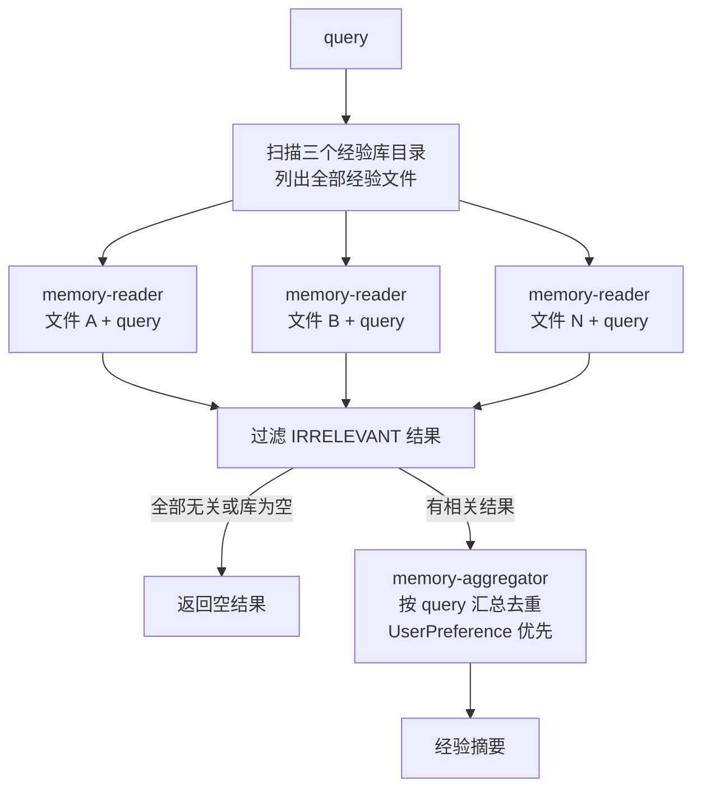
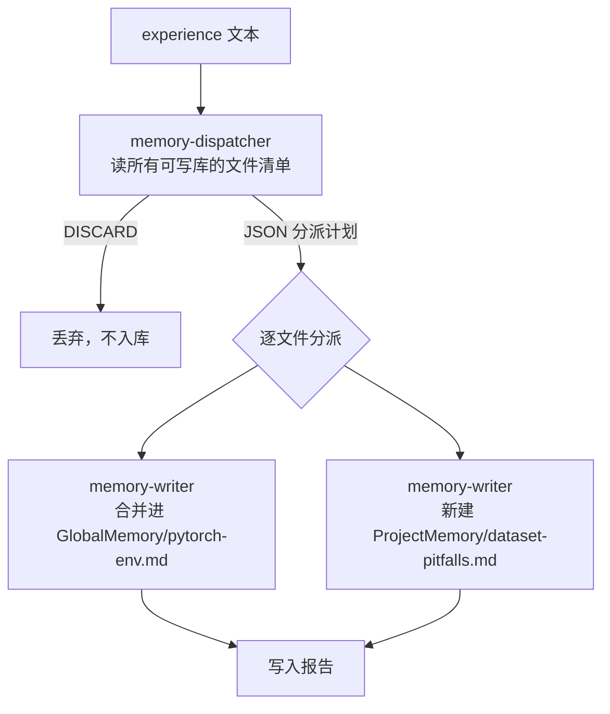
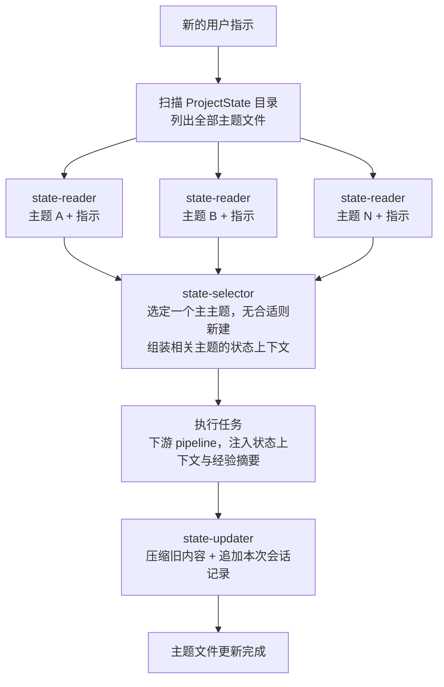

# Memory Pipeline（记忆库机制设计）

`src/memory` 计划基于 `coding-agent-forge` 实现一套以 Markdown 文件为载体、由 agent 负责读写的记忆机制，为各 pipeline 提供跨任务、跨项目的长期经验沉淀，以及项目内按主题延续的会话状态。

> 当前状态：设计稿，尚未实现。本机制是根 README 中提到的、用来替代或扩展 `TODO.md` 临时记忆方案的"更高级记忆机制"。

## 设计动机

现有开发循环的记忆只有两类：`--goal-path` 提供的本轮目标，以及 `TODO.md` 维护的任务连续性。它们都活不过一个项目、也沉淀不下可复用的经验。我们希望：

- agent 在任务中踩过的坑、验证过的做法，能跨运行、跨项目复用；
- 用户的长期偏好（代码风格之外的，例如写作语气、工具选择、交互习惯）能被记住并在所有项目中生效；
- 项目内部的约定（目录结构、数据集的坑、实验配置）能在同一项目的多轮运行间延续；
- agent "之前做到哪了、正在做什么"的会话状态能按任务主题延续，新指示来了能接着干，而不是从零开始。

核心取舍：**不引入向量检索等额外基础设施**，记忆就是一组人类可读的 Markdown 文件，读和写都由 agent 用语义理解完成。

## 记忆总体结构

记忆分两类：**经验库**（沉淀"怎么做得好"）和**状态库**（记录"做到哪了"）。共四个库：

| 库 | 类型 | 作用域 | 保存内容 | 默认位置（可配置） |
| -- | ---- | ------ | -------- | ------------------ |
| `GlobalMemory` | 经验 | 全局，跨项目 | agent 自己总结的通用经验（环境配置、调试套路、实验方法……） | `~/.academic-army/memory/global-memory/` |
| `UserPreference` | 经验 | 全局，跨项目 | 用户偏好（来自用户的显式反馈与修改习惯） | `~/.academic-army/memory/user-preference/` |
| `ProjectMemory` | 经验 | 单项目 | 项目专属经验（代码库约定、数据集的坑、本项目实验配置……） | `output/memory/` |
| `ProjectState` | 状态 | 单项目 | agent 的会话状态，相当于对话 session，按**任务主题**分文件记录之前做过什么 | `output/state/` |

### 经验库：三个实例，一个统一抽象

机制上经验库只有一种东西：**bank = 一个目录 + 一段描述 + 是否可写**。`GlobalMemory` / `UserPreference` / `ProjectMemory` 走完全相同的读写机制，代码上不区分对待；区别只体现在传给 agent 的 `description` 和路径上。检索时三个库都参与；写入时由分派 agent 判断经验归属哪个库。

读取汇总时的优先级约定：**`UserPreference` > `ProjectMemory` > `GlobalMemory`**，冲突时以用户偏好为准。

### 状态库：ProjectState 与经验库的区别

`ProjectState` 复用同样的"目录 + 每文件一个主题"的文件组织，但语义和读写机制都不同：

| | 经验库（三个） | 状态库（`ProjectState`） |
| -- | ------------- | ------------------------ |
| 内容 | 可复用的经验教训（语义记忆） | 做过什么、进展、决策、未竟事项（情景记忆 / session） |
| 文件划分 | 每文件一种经验类型 | 每文件一个**任务主题** |
| 读取 | 按 query 检索可借鉴的经验 | 按新用户指示选主题、加载相关上下文 |
| 写入 | 合并去重，维护"当前最佳实践" | **压缩旧内容 + 追加本次会话记录** |
| 时态 | 长期有效 | 跟随项目进展不断演化 |

`ProjectState` 正是用来替代单一 `TODO.md` 的：把"一个文件记所有事"升级为"按任务主题分治的会话记忆"。

### 目录布局

```
~/.academic-army/memory/          # 全局（项目外，跨项目共享）
├── global-memory/                # GlobalMemory：agent 自己总结的经验
│   ├── pytorch-env.md
│   ├── experiment-debugging.md
│   └── ...
└── user-preference/              # UserPreference：用户偏好
    ├── writing-tone.md
    └── ...

output/                           # 项目内（随项目走）
├── memory/                       # ProjectMemory：项目专属经验
│   ├── codebase-conventions.md
│   ├── dataset-pitfalls.md
│   └── ...
└── state/                        # ProjectState：按任务主题的会话状态
    ├── model-training.md
    ├── paper-writing.md
    └── ...
```

### 经验文件格式

每个文件只保存**一种类型**的经验。文件头用 YAML frontmatter 声明主题，正文是条目化的经验列表：

```markdown
---
name: pytorch-env
description: PyTorch/CUDA 环境配置与依赖安装的经验
---

- [2026-06-10] Windows 下安装 PyTorch 时优先使用官方 index-url，避免 ……
- [2026-06-02] CUDA 版本与 driver 不匹配时，先 …… 再 ……
```

约定：

- `description` 是分派和粗筛的依据，必须准确描述"这个文件管什么"；
- 正文条目应是"当前最佳实践"，不是流水账日志——写入 agent 负责合并与去重；
- 文件名 kebab-case，与 `name` 一致。

### 状态文件格式

每个文件对应一个**任务主题**，正文按"近期详细、久远压缩"组织：

```markdown
---
name: model-training
description: 模型训练与调参任务的会话状态
---

## 当前状态
- baseline 已跑通，正在调 lr schedule；下一步补消融实验

## 关键决策
- 选用 AdamW 而非 SGD，因为 ……

## 历史摘要（压缩）
- 早期：搭好训练框架，修复了 dataloader 的 ……

## 最近活动
- [2026-06-10] 用户指示 ……；执行了 ……；结果 ……
```

## Agent 角色

经验库四个 agent，状态库三个 agent：

| Agent | 职责 | 输入 | 输出 | 线程权限 |
| ----- | ---- | ---- | ---- | -------- |
| `memory-reader` | 读一个经验文件，提取与 query 相关的经验 | query + 单个经验文件路径 | 相关经验摘录；无关时返回 `IRRELEVANT` | 只读 |
| `memory-aggregator` | 汇总各 reader 的结果 | query + 所有相关结果（带来源标注） | 去重、组织后的经验摘要 | 只读 |
| `memory-dispatcher` | 写入时的上级 agent，分派经验 | 经验文本 + 所有可写库的文件清单（name + description） | JSON 分派计划；不值得保存时返回 `DISCARD` | 只读 |
| `memory-writer` | 把分派片段合并进一个目标文件 | 目标文件路径 + 文件主题 + 经验片段 | 写入说明 | 可写 |
| `state-reader` | 读一个主题的状态文件，判断与新指示的相关性 | 用户指示 + 单个状态文件路径 | 相关状态上下文；无关时返回 `IRRELEVANT` | 只读 |
| `state-selector` | 为本次指示选定一个主主题并组装上下文 | 用户指示 + 主题清单 + 各 reader 的相关结果 | JSON：选定主题（或新建）+ 组装好的状态上下文 | 只读 |
| `state-updater` | 任务结束后更新主题状态 | 主题文件路径 + 本次会话记录 | 更新说明 | 可写 |

标记沿用现有 pipeline 的单词大写约定（`FINISHED` / `ACCEPT`），新增 `IRRELEVANT` 与 `DISCARD`。

## 经验检索流程（retrieve）

输入一个 query（"我要做的事和什么有关"），输出一份汇总的经验摘要。`ProjectState` 不参与经验检索。



1. 扫描三个经验库的目录，列出所有经验文件；
2. **为每个文件创建一个独立的 `memory-reader`**，并行运行（并发上限可配，默认 4）：读文件 + query，总结出可借鉴的相关经验，没有就返回 `IRRELEVANT`；
3. 过滤掉 `IRRELEVANT` 的结果；若全部无关（或库为空），直接返回空字符串，调用方据此跳过经验注入；
4. 其余结果带上来源（哪个库、哪个文件）交给 `memory-aggregator`，按 query 汇总成一份去重、有条理的摘要，冲突时按 `UserPreference` > `ProjectMemory` > `GlobalMemory` 裁决；
5. 返回摘要，由调用方注入到下游 agent 的 prompt 中。

reader 的价值不只是召回原文，而是**针对 query 做总结和适配**——文件里记的是通用经验，reader 输出的是"对你这个任务而言意味着什么"。

## 经验写入流程（store）

输入一段经验文本（由调用方提炼好），由上级 agent 分派、对应 writer 写入。



1. 构建**库目录清单**：列出每个可写库的描述及其所有文件的 `name` + `description`（只读 frontmatter，不读全文）；
2. `memory-dispatcher` 读经验文本和清单，做三层判断：
   - **要不要存**：低价值流水账直接返回 `DISCARD`（质量闸门，防止记忆库膨胀）；
   - **存到哪个库**：可泛化 → `GlobalMemory`；体现用户意志 → `UserPreference`；只对本项目有效 → `ProjectMemory`；
   - **存到哪些文件**：一条经验可拆成多个片段分别归入不同文件；优先并入现有文件，确无归属时才新建（新文件必须给出 `name` + `description`）；
3. 输出 JSON 分派计划，例如：

```json
{
  "assignments": [
    {
      "bank": "GlobalMemory",
      "file": "pytorch-env.md",
      "isNew": false,
      "experience": "分派给该文件的经验片段……"
    },
    {
      "bank": "ProjectMemory",
      "file": "dataset-pitfalls.md",
      "isNew": true,
      "description": "本项目数据集处理的坑",
      "experience": "……"
    }
  ]
}
```

4. 对每个分派项启动一个 `memory-writer`（不同文件可并行；每文件恰好一个 writer，天然避免写冲突）。writer **合并而非追加**：去掉与既有条目重复的内容，与旧条目冲突时以新经验为准，保持文件聚焦于自己的主题，并维护 frontmatter 格式；
5. 汇总各 writer 的写入说明，返回写入报告（写了哪些文件、新建了哪些、是否丢弃）。

容错约定：dispatcher 输出的 JSON 解析失败时重试一次，仍失败则放弃本次写入并报错——宁可丢一条经验，不能写坏记忆库。writer 的 prompt 约束其只许修改自己的目标文件。

## ProjectState 会话循环（load / update）

每次有新的**用户指示**进来，都必须为它选定一个任务主题，带着该主题（及其它相关主题）的状态上下文去执行；执行结束后更新主题状态。整个循环：



### 加载与选主题（load）

1. 扫描 `ProjectState` 目录，列出所有主题文件；
2. **为每个主题文件创建一个独立的 `state-reader`**，并行运行：读状态文件 + 用户指示，判断该主题与指示是否相关；相关则提取"接续这件事需要知道的上下文"（当前进展、关键决策、未竟事项），无关返回 `IRRELEVANT`；
3. `state-selector` 读用户指示、主题清单和各 reader 的结果，输出 JSON：
   - **主主题**：本次指示归属的那一个主题——通常是最相关的现有主题；若指示开启了全新的事，则新建主题（给出 `name` + `description`）。**每次指示必须且只能选定一个主主题**；
   - **状态上下文**：把所有相关主题的上下文组装成一段可注入下游 prompt 的文本（跨主题相关时，其它主题只作为上下文参考，不会被本次更新）；
4. 返回 `{ topic, isNew, context }`，调用方把 `context` 注入执行任务的 agent，并记住 `topic` 用于结束后更新。

状态库为空（项目刚开始）时跳过 fan-out，直接由 selector 根据指示新建第一个主题。

### 执行后更新（update）

任务执行结束后，调用方把**本次会话记录**（用户指示、做了什么、结果如何、遗留事项）交给 `state-updater`，定向更新主主题文件：

- **压缩**：把"最近活动"中久远的条目折叠进"历史摘要"，丢弃过时细节，控制文件长度（软上限，建议约 200 行）；
- **追加**：在"最近活动"中加入本次会话记录，刷新"当前状态"和"关键决策"。

这就是"压缩之前的并往里加东西"：状态文件像一个不断 compaction 的对话 session，近期细、久远粗，总量有界。

## 模块结构规划

```
src/memory/
├── README.md            # 本设计文档
├── index.ts             # 导出 API 与 pipeline
├── bank.ts              # 库抽象：目录扫描、frontmatter 解析、目录初始化、清单构建（经验库与状态库共用）
├── pipeline.ts          # retrieveMemory / storeMemory 编排 + CLI pipeline 定义
├── state.ts             # loadProjectState / updateProjectState 编排
└── agents/
    ├── index.ts
    ├── factory.ts       # agentFactories
    ├── reader.ts        # MemoryReaderAgent
    ├── aggregator.ts    # MemoryAggregatorAgent
    ├── dispatcher.ts    # MemoryDispatcherAgent
    ├── writer.ts        # MemoryWriterAgent
    ├── state-reader.ts  # StateReaderAgent
    ├── state-selector.ts# StateSelectorAgent
    └── state-updater.ts # StateUpdaterAgent
```

### API 草案

```ts
export type MemoryBank = {
  name: string;        // "GlobalMemory" | "UserPreference" | "ProjectMemory" 或自定义
  path: string;        // 记忆库目录
  description: string; // 这个库保存什么，给 dispatcher / aggregator 看
  writable: boolean;
};

export type RetrieveMemoryOptions = {
  banks: readonly MemoryBank[];
  query: string;
  maxConcurrency?: number; // 默认 4
};

// 返回汇总后的经验摘要；无相关经验时返回 ""
export async function retrieveMemory(
  team: AgentTeam<MemoryAgentVariablesByName>,
  options: RetrieveMemoryOptions,
): Promise<string>;

export type StoreMemoryOptions = {
  banks: readonly MemoryBank[]; // 仅 writable 的库进入分派范围
  experience: string;           // 调用方提炼好的经验文本
};

// 返回写入报告：更新/新建了哪些文件，或被 DISCARD
export async function storeMemory(
  team: AgentTeam<MemoryAgentVariablesByName>,
  options: StoreMemoryOptions,
): Promise<StoreMemoryReport>;

export type LoadProjectStateOptions = {
  statePath: string;       // ProjectState 目录
  instruction: string;     // 新的用户指示
  maxConcurrency?: number; // 默认 4
};

export type LoadedProjectState = {
  topic: string;   // 选定的主主题（文件名 name）
  isNew: boolean;  // 是否为本次新建的主题
  context: string; // 组装好的状态上下文；状态库为空且新建主题时为 ""
};

export async function loadProjectState(
  team: AgentTeam<MemoryAgentVariablesByName>,
  options: LoadProjectStateOptions,
): Promise<LoadedProjectState>;

export type UpdateProjectStateOptions = {
  statePath: string;
  topic: string;         // loadProjectState 选定的主主题
  sessionRecord: string; // 本次会话记录：指示、操作、结果、遗留事项
};

export async function updateProjectState(
  team: AgentTeam<MemoryAgentVariablesByName>,
  options: UpdateProjectStateOptions,
): Promise<void>;
```

### Agent 变量草案

```ts
export type MemoryReaderVariables = {
  query: string;
  memoryFilePath: string;
  irrelevantMark: string; // IRRELEVANT
};

export type MemoryAggregatorVariables = {
  query: string;
  findings: string; // 各 reader 相关结果的拼接，带来源库/文件标注
};

export type MemoryDispatcherVariables = {
  experience: string;
  bankCatalog: string; // 可写库及其文件的 name + description 清单
  discardMark: string; // DISCARD
};

export type MemoryWriterVariables = {
  memoryFilePath: string;
  topic: string;      // 目标文件的 description
  experience: string; // 分派给该文件的经验片段
};

export type StateReaderVariables = {
  instruction: string;
  stateFilePath: string;
  irrelevantMark: string; // IRRELEVANT
};

export type StateSelectorVariables = {
  instruction: string;
  topicCatalog: string; // 主题清单：name + description
  findings: string;     // 各 state-reader 相关结果的拼接
};
// 输出 JSON: { "topic": "...", "isNew": false, "description": "...", "context": "..." }

export type StateUpdaterVariables = {
  stateFilePath: string;
  sessionRecord: string; // 本次会话记录
};
```

## CLI 与配置

采用 forge 新版 `definePipeline`（同 `evolve-skill` 的写法），在 `src/cli.ts` 注册四个子命令，便于单独调试：

```bash
# 经验检索：输出汇总摘要到 stdout
npm run cli -- memory-retrieve \
  --config agent-forge.yaml \
  --global-memory-path ~/.academic-army/memory \
  --project-memory-path output/memory \
  --query "如何为本项目配置 PyTorch 训练环境"

# 经验写入：从文件读入经验文本并入库
npm run cli -- memory-store \
  --config agent-forge.yaml \
  --global-memory-path ~/.academic-army/memory \
  --project-memory-path output/memory \
  --experience-path output/lessons.md

# 状态加载：为新指示选主题并输出状态上下文
npm run cli -- state-load \
  --config agent-forge.yaml \
  --state-path output/state \
  --instruction-path output/goal.md

# 状态更新：任务结束后压缩并追加会话记录
npm run cli -- state-update \
  --config agent-forge.yaml \
  --state-path output/state \
  --topic model-training \
  --session-record-path output/session.md
```

`--global-memory-path` 指向全局记忆根目录，其下的 `global-memory/`（`GlobalMemory`）与 `user-preference/`（`UserPreference`）两个子目录由 pipeline 自动初始化。

`agent-forge.yaml` 新增 agents（复用现有线程定义）：

```yaml
agents:
  memory-reader:
    thread: codex-5.5-read-only
  memory-aggregator:
    thread: codex-5.5-read-only
  memory-dispatcher:
    thread: codex-5.5-read-only
  memory-writer:
    thread: codex-5.5-full-access
  state-reader:
    thread: codex-5.5-read-only
  state-selector:
    thread: codex-5.5-read-only
  state-updater:
    thread: codex-5.5-full-access
```

## 与现有 Pipeline 的集成

`developing` 已有 hooks（`beforeRevisionLoop` / `afterRevision` / `afterTodoUpdate`），集成方式与 `developing-skill` 叠加 `trajectory-optimizer` 的做法一致——新增一个 `developing-memory` 包装（或并入 `developing-skill`）：

- **运行开始时**：把 `--goal-path` 的内容视为本次用户指示，调 `loadProjectState` 选定主主题并拿到状态上下文，注入 `coding-manager`（选任务时知道之前做到哪了）；
- **任务开始前**（`beforeRevisionLoop`）：以 `currentTask` 为 query 调 `retrieveMemory`，把经验摘要与状态上下文一起注入 `developer` / `code-reviewer` 的 prompt（为空则不注入）；
- **任务结束后**（`afterTodoUpdate`）：把 `currentTask` + `revisionReport` 交给一个**经验提炼步骤**，得到候选经验文本后调 `storeMemory`；
- **运行结束时**：汇总本轮做了什么（指示、各任务、结果、遗留事项）作为会话记录，调 `updateProjectState` 更新主主题文件。

状态上下文回答"接着干什么"，经验摘要回答"怎么干得好"，两者互补。`ProjectState` 稳定后可逐步替代 `TODO.md` 的任务记忆职责。

注意分工：经验库的写入口只收"提炼好的经验文本"，状态库的更新口只收"本次会话记录"。从冗长 trajectory/report 中提炼这两种文本是调用方（或一个独立的 `memory-extractor` agent）的职责，不属于记忆库核心——dispatcher 只做分派、updater 只做压缩追加，避免单个 agent 同时承担差异很大的任务。

## 设计取舍

- **每文件一个 reader，而不是向量检索**：记忆文件的数量级是几十而不是几万，fan-out 完全可行；LLM 的语义匹配能力远强于向量相似度，且 reader 还能针对 query 做总结适配，而不只是召回原文；零基础设施，记忆库本身对人类完全可读可改。代价是检索成本与文件数线性相关，因此必须控制文件数量（见下一条）。
- **控制文件膨胀**：dispatcher / selector 倾向并入现有文件而非新建；每库建议软上限约 20 个文件；经验文件靠合并去重、状态文件靠压缩控制长度。这同时保证了检索成本与文件质量。
- **经验与状态分离**：两者的写入语义完全不同——经验是合并出"当前最佳实践"，状态是压缩+追加的时间线；读取语义也不同——经验按 query 找借鉴，状态按指示接续上下文。混在一起会让 writer/updater 的 prompt 目标冲突。
- **每次指示必选且只选一个主主题**：保证每轮活动都有唯一归属、状态可追溯；其它相关主题只作为上下文读取，不被本次更新，避免一次写多个状态文件造成发散。
- **dispatcher 统一跨库分派**："这条经验是全局可泛化还是项目专属"、"是客观经验还是用户偏好"本身就是语义判断，集中在一个 agent 做最合适，还能把一条经验拆成多个片段分别入库。
- **`DISCARD` 质量闸门**：写入端宁缺毋滥。记忆库的价值取决于信噪比，而不是条目数量。
- **合并而非追加（经验）、压缩即遗忘（状态）**：经验文件维护"当前最佳实践"，新旧冲突以新为准；状态文件近期细、久远粗，总量有界。两者都是轻量的记忆更新/遗忘机制。

## 未来扩展

- **粗筛层**：文件数变多后，检索可先由单个 agent 根据 frontmatter `description` 选出候选文件，再对候选 fan-out 细读，把成本从 O(全部文件) 降到 O(候选文件)；
- **定期整理（consolidation）**：当某文件过长或多个文件主题重叠时，由维护 agent 压缩合并、拆分重组；主题做完归档（archive）出活跃目录；
- **从状态蒸馏经验**：定期把 `ProjectState` 各主题中的教训提炼成经验文本走 `storeMemory` 入库——状态是经验的天然原料；
- **遗忘机制**：按条目时间戳与使用频率淘汰陈旧经验；
- **经验提炼 agent（`memory-extractor`）**：从开发轨迹自动提炼候选经验与会话记录，打通 `developing` 全自动闭环；
- **偏好采集**：从用户对产物的直接修改 diff 中归纳用户偏好，写入 `UserPreference`。
